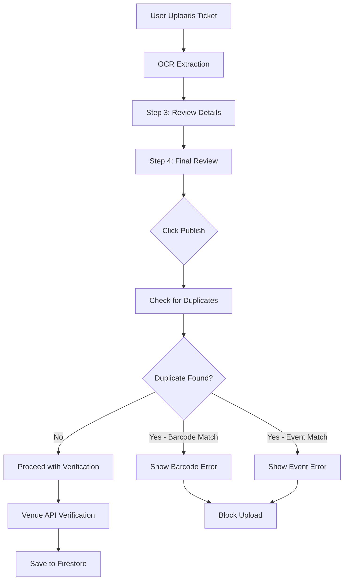

# Duplicate Ticket Detection Implementation

## Overview

Implemented a comprehensive duplicate ticket detection system to prevent users from uploading the same ticket multiple times.

## Features

### Duplicate Detection Strategy

The system uses **two detection methods**:

1. **Barcode Matching** (Primary)

   - Checks if a ticket with the same barcode already exists
   - Highest priority - barcodes are unique identifiers
   - Prevents fraud (same physical ticket uploaded multiple times)

2. **Event Details Matching** (Secondary)
   - Checks for exact match on: artist + venue + date + time
   - Catches duplicates even when barcode is missing or not detected
   - Prevents accidental re-uploads of the same event

### How It Works



## Implementation Details

### API Endpoint: `/api/check-duplicate`

**Location:** `app/api/check-duplicate/route.ts`

**Request:**

```json
{
  "barcode": "9780123456789",
  "artist": "עומר אדם",
  "venue": "היכל מנורה מבטחים",
  "date": "15/03/2026",
  "time": "21:00"
}
```

**Response (Duplicate Found):**

```json
{
  "isDuplicate": true,
  "duplicates": [
    {
      "id": "ticket_doc_id",
      "matchType": "barcode",
      "matchedFields": ["barcode"],
      "ticket": {
        "artist": "עומר אדם",
        "venue": "היכל מנורה מבטחים",
        "date": "15/03/2026",
        "time": "21:00",
        "barcode": "9780123456789",
        "seat": "12",
        "row": "5",
        "section": "VIP",
        "status": "available"
      }
    }
  ],
  "message": "כרטיס עם אותו ברקוד כבר קיים במערכת"
}
```

**Response (No Duplicate):**

```json
{
  "isDuplicate": false,
  "duplicates": [],
  "message": "אין כרטיס כפול"
}
```

### Upload Flow Integration

**Location:** `app/components/Dialogs/UploadTicketDialog/UploadTicketDialog.tsx`

**Changes:**

1. Added duplicate check **before** venue verification
2. Check happens in `publishAllTickets()` function
3. Blocks upload if duplicate detected
4. Shows detailed error message

**Flow:**

```typescript
// STEP 0: Check for duplicates
const duplicateCheck = await fetch("/api/check-duplicate", {
  method: "POST",
  body: JSON.stringify({
    barcode: ticket.ticketDetails?.barcode || "",
    artist: ticket.ticketDetails?.artist || "",
    venue: ticket.ticketDetails?.venue || "",
    date: normalizedDate,
    time: ticket.ticketDetails?.time || "",
  }),
});

if (duplicateResult.isDuplicate) {
  // Show error and block upload
  setPublishError(errorMessage);
  return false;
}

// STEP 1: Verify with venue API (only if no duplicate)
// STEP 2: Save to Firestore
```

### Error Display

**Location:** `app/components/Dialogs/UploadTicketDialog/UploadTicketSteps/StepFourUploadTicket.tsx`

**UI Features:**

- Red error banner at top of Step 4
- Shows detailed information about existing ticket
- Includes artist, venue, date, seat info
- Shows status of existing ticket (published/pending/rejected)
- Prevents user from proceeding

**Example Error Messages:**

**Barcode Duplicate:**

```
 כרטיס עם ברקוד זהה כבר קיים במערכת

פרטי הכרטיס הקיים:
• אירוע: עומר אדם
• מקום: היכל מנורה מבטחים
• תאריך: 15/03/2026
• סטטוס: מפורסם

לא ניתן להעלות כרטיס כפול.
```

**Event Details Duplicate:**

```
 כרטיס זהה לאירוע זה כבר קיים במערכת

פרטי האירוע:
• עומר אדם
• היכל מנורה מבטחים
• 15/03/2026 בשעה 21:00
• מקום: אזור VIP שורה 5 מושב 12

לא ניתן להעלות כרטיס כפול.
```

## User Experience

### Before (Without Duplicate Detection)

1. User uploads ticket
2. Ticket gets published
3. User accidentally uploads same ticket again
4. System creates duplicate listing
5. Admin must manually find and delete duplicates

### After (With Duplicate Detection)

1. User uploads ticket
2. Ticket gets published
3. User accidentally uploads same ticket again
4. System detects duplicate and shows error
5. Upload blocked, no duplicate created
6. User sees which existing ticket matches

## Technical Details

### Normalization

All strings are normalized for consistent matching:

```typescript
const normalizeString = (str: string | null | undefined): string => {
  if (!str) return "";
  return str.trim().toLowerCase().replace(/\s+/g, " ");
};
```

**Why?**

- "היכל מנורה" === "היכל מנורה" (extra spaces)
- "Omer Adam" === "omer adam" (case)
- Handles Hebrew and English text

### Performance Considerations

**Barcode Query:**

- Fast - uses Firestore `where("barcode", "==", value)` index
- O(log n) lookup time

**Event Details Query:**

- Slower - fetches all tickets and filters manually
- Required because Firestore doesn't support case-insensitive queries
- Could be optimized with Cloud Functions or pre-normalized fields

### Edge Cases Handled

1. **No Barcode Detected**

   - Falls back to event details matching
   - Still prevents duplicates

2. **Barcode + Event Details Both Match**

   - Deduplicates results (doesn't show duplicate twice)
   - Shows barcode match (higher priority)

3. **Duplicate Check API Failure**

   - Logs error but doesn't block upload
   - Better UX than blocking on API error
   - Could be changed to block if fraud is a concern

4. **Multiple Duplicates Found**
   - Shows first duplicate only (simplifies UI)
   - All duplicates logged to console

## Security & Fraud Prevention

### Barcode Fraud Prevention

- Same barcode cannot be uploaded twice
- Prevents users from creating fake tickets with real barcodes
- Protects venue partnerships (one barcode = one ticket)

### Accidental Duplicate Prevention

- Prevents users from accidentally uploading same ticket
- Saves admin time (no manual duplicate cleanup)
- Improves marketplace quality (no duplicate listings)

### Limitations

- Different users can't upload same physical ticket
- **Pro:** Prevents fraud (one user stealing another's ticket photo)
- **Con:** If legitimate owner sells ticket, buyer can't re-list
- **Solution:** Add ticket transfer feature in future

## Testing Checklist

### Test Case 1: Barcode Duplicate

- [ ] Upload ticket with barcode (e.g., 9780123456789)
- [ ] Publish successfully
- [ ] Try uploading same ticket again
- [ ] Should show barcode duplicate error
- [ ] Should block upload

### Test Case 2: Event Details Duplicate

- [ ] Upload ticket without barcode
- [ ] Set: Omer Adam, Menorah Arena, 15/03/2026, 21:00
- [ ] Publish successfully
- [ ] Upload different ticket image with same details
- [ ] Should show event duplicate error
- [ ] Should block upload

### Test Case 3: Different Event (Same Barcode)

This shouldn't happen in real world, but tests the system:

- [ ] Upload ticket with barcode 123456789
- [ ] Upload different event with same barcode
- [ ] Should detect barcode duplicate
- [ ] Should block regardless of event details

### Test Case 4: Same Event, Different Seats

- [ ] Upload ticket: Omer Adam, Menorah, 15/03/2026, 21:00, Seat 12
- [ ] Upload ticket: Omer Adam, Menorah, 15/03/2026, 21:00, Seat 13
- [ ] Should allow both (different seats, assuming different barcodes)

### Test Case 5: No Duplicate

- [ ] Upload unique ticket
- [ ] Should pass duplicate check
- [ ] Should proceed to verification
- [ ] Should save to Firestore

## Future Enhancements

1. **Ticket Transfer System**

   - Allow legitimate ticket transfers
   - Update barcode ownership in database
   - Notify previous owner

2. **Seat-Level Duplicate Detection**

   - Check if same seat already uploaded for event
   - Even more precise fraud prevention

3. **Image Similarity Detection**

   - Use computer vision to detect duplicate images
   - Catches duplicates even if OCR differs
   - Prevents screenshot/cropped ticket duplicates

4. **Admin Override**

   - Allow admins to bypass duplicate check
   - Useful for legitimate edge cases
   - Audit log of overrides

5. **User Notification**
   - Email user if duplicate detected
   - Could indicate fraud attempt
   - Security feature

## Files Changed

1.  `app/api/check-duplicate/route.ts` - New API endpoint
2.  `app/components/Dialogs/UploadTicketDialog/UploadTicketDialog.tsx` - Added duplicate check
3.  `app/components/Dialogs/UploadTicketDialog/UploadTicketSteps/StepFourUploadTicket.tsx` - Error display
4.  `app/components/Dialogs/UploadTicketDialog/UploadTicketSteps/UploadTicketInterface.types.ts` - Added publishError prop

## Summary

**Barcode duplicate detection** - Prevents same barcode twice  
 **Event details duplicate detection** - Catches duplicates without barcodes  
 **User-friendly error messages** - Clear explanation in Hebrew  
 **Detailed duplicate info** - Shows existing ticket details  
 **Blocks upload** - Prevents duplicate from being created  
 **Logging** - Comprehensive console logs for debugging  
 **Graceful degradation** - Works even if duplicate check fails

**Status:** Fully implemented and ready for testing
