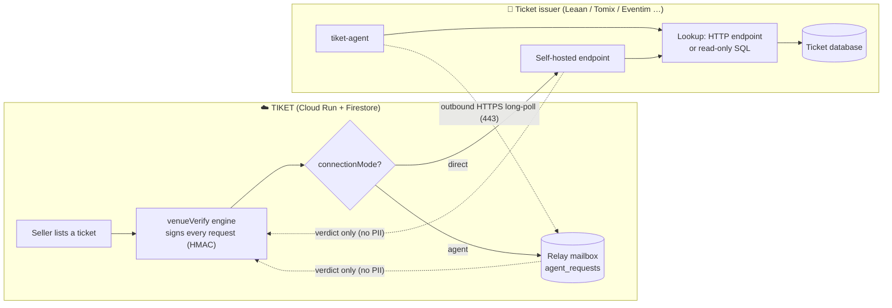
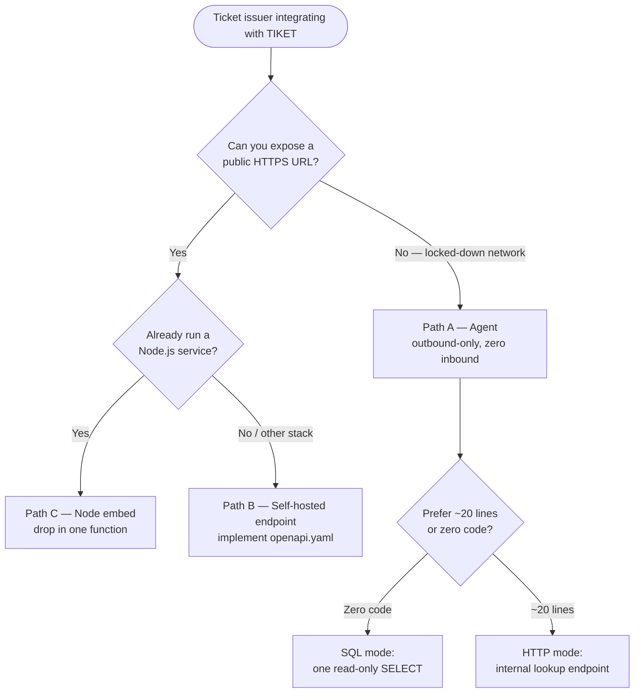
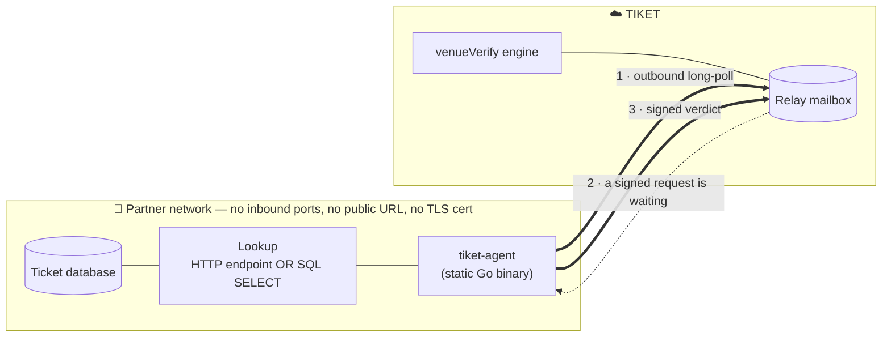
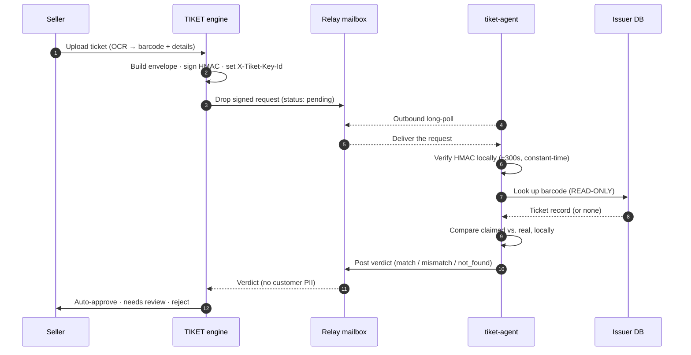
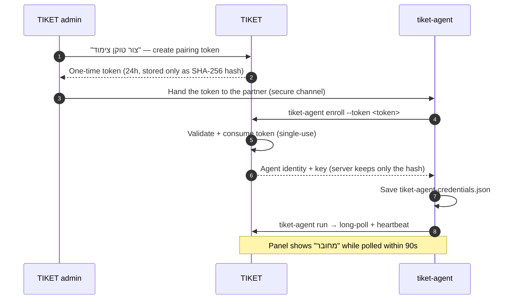
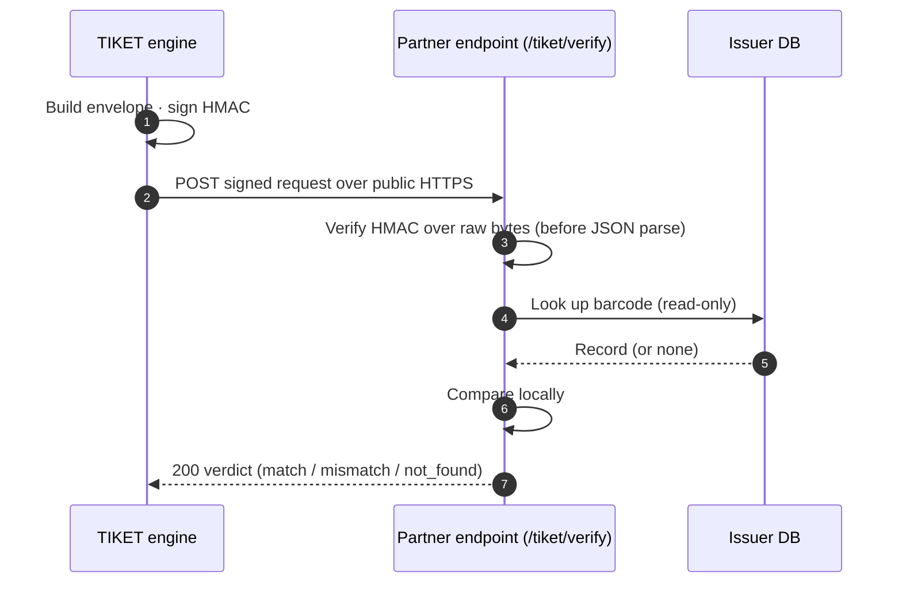
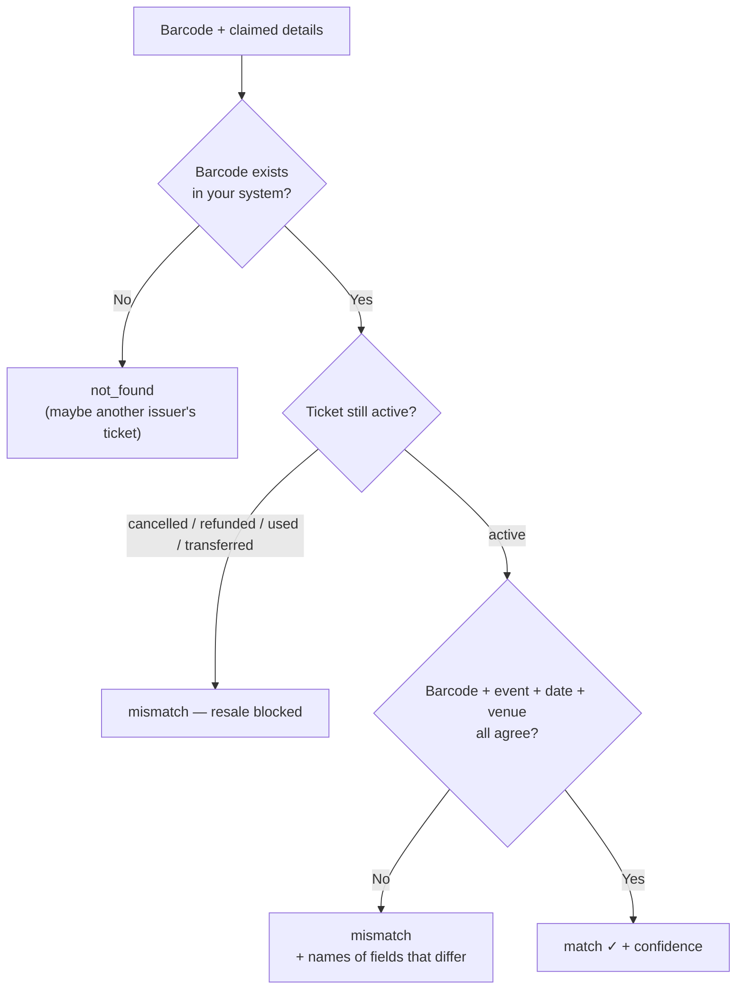
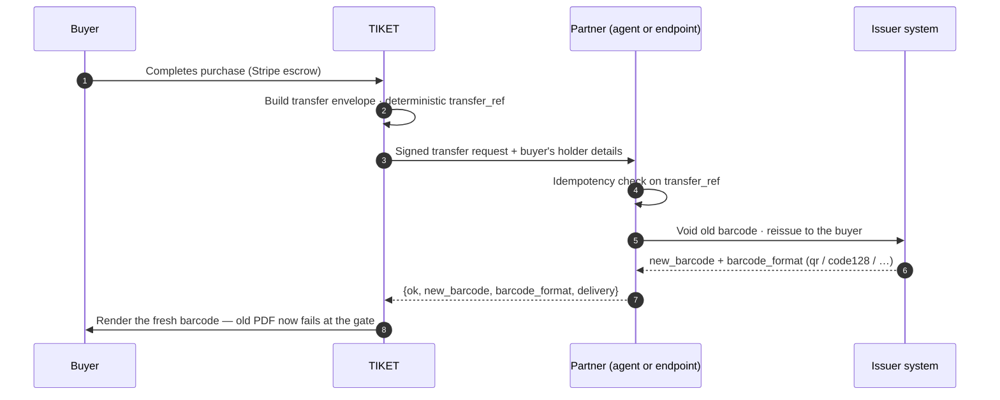
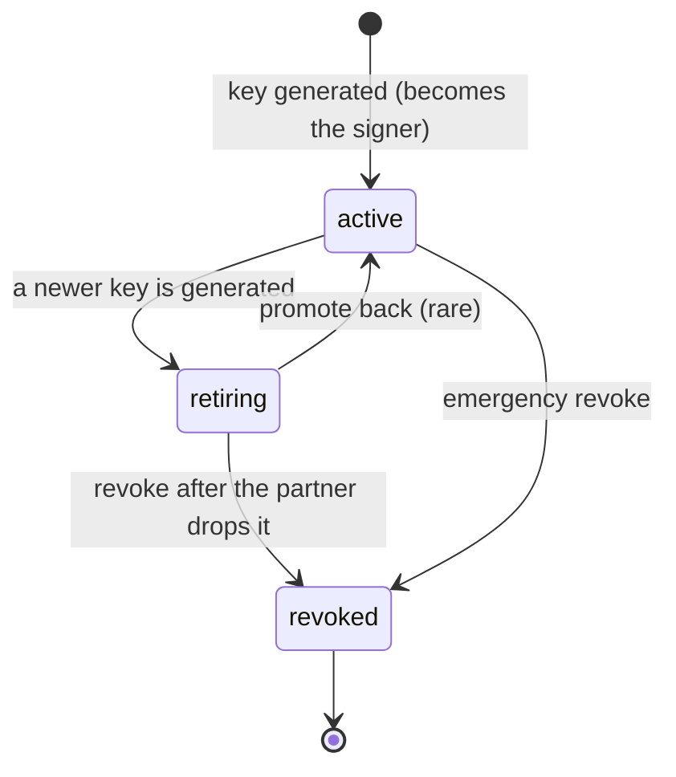

# Tiket Connect — Architecture & Flows

How the whole system fits together, with a diagram for every path and every
flow. This is the "see it at a glance" companion to
[`INTEGRATION_GUIDE.md`](INTEGRATION_GUIDE.md) (the how-to) and
[`SECURITY.md`](SECURITY.md) (the threat model).

**What Tiket Connect is:** a signed request/response protocol that lets TIKET
ask the company that *issued* a ticket one question — *"is this barcode real,
still valid, and does it match these details?"* — and, on resale, hand the
ticket to its new owner. The comparison runs **inside the issuer's system**;
only a verdict (`match` / `mismatch` / `not_found`) crosses the wire. No
customer data ever leaves the issuer.

---

## 1. The big picture



Two transports, one protocol:

- **Agent (relay):** the issuer opens **nothing** inbound. A small program
  (`tiket-agent`) dials *out* to TIKET and picks work off a mailbox.
- **Direct:** the issuer hosts a public HTTPS endpoint TIKET calls straight.

Either way every request is HMAC-signed and re-verified inside the issuer's
deployment, so the transport in between is untrusted by design.

---

## 2. Which path? (decision tree)



| Path | You deploy | You write | Inbound exposure |
| --- | --- | --- | --- |
| **A. Agent** (recommended) | one static binary / container | 0–20 lines | **none** |
| **B. Self-hosted endpoint** | a small HTTPS service | ~50 lines from the spec | one public URL |
| **C. Node embed** | nothing new | one function | your existing app's URL |

---

## 3. Path A — the Agent

### Topology (nothing is reachable from the internet)



### Verify — full round trip



### Enrollment (one-time pairing)



---

## 4. Paths B & C — direct endpoint

Same protocol, TIKET just calls the issuer's URL instead of a mailbox.



- **Path C (Node embed):** copy `node/tiket-connect.js`, implement one
  `lookupTicket(barcode)` function — the kit handles signing, matching,
  normalization, rotation, transfer. Mount as middleware or `listen()`.
- **Path B (any stack):** implement [`openapi.yaml`](openapi.yaml); validate
  against [`spec/test-vectors.json`](spec/test-vectors.json).

---

## 5. The verification decision (identical on every path)



- Only **field names** ever come back on a mismatch — never the correct
  values. If a seller claims seat 12 and the truth is 14, TIKET learns only
  that `seat` didn't match.
- Missing optional fields are excluded from scoring, never held against the
  seller. Date formats, "07" vs "7", partial venue names, whitespace — all
  normalized by the kit/agent, so the issuer returns records **as they are**.

---

## 6. Ownership transfer (optional, closes the "kept PDF" hole)

Verification catches fakes at listing time. Transfer makes a *real but resold*
ticket's original copy worthless: the old barcode is voided and a fresh one is
issued to the buyer.



- `transfer_ref` is deterministic, so retries never transfer twice; **durable**
  idempotency (one small table keyed on `transfer_ref`) is the issuer's job.
- The buyer's contact details are the one thing that flows *toward* the issuer
  — the minimum needed to issue the ticket to its new lawful holder.
- Skipping transfer is fine: the endpoint answers `not_supported` and TIKET
  falls back to manual handover; verification keeps working.

---

## 7. Security — the signed envelope

Every request carries a Stripe-webhook-style signature:

```
X-Tiket-Timestamp: 1700000000
X-Tiket-Signature: hex( HMAC_SHA256( secret, timestamp + "." + rawBody ) )
X-Tiket-Version:   1
X-Tiket-Key-Id:    k_ab12cd34     ← names the signing key (for rotation)
```

The receiver (1) rejects if the timestamp is >300s off, (2) recompiles the
signature over the **raw bytes** and compares constant-time, (3) only then
parses the JSON. A leaked-but-old message is useless; a tampered body breaks
the signature.

### Key rotation — zero downtime

`activeKeyId` names the key TIKET signs with now; the issuer may hold several
secrets and accept any non-revoked one. Each key moves through:



Rotation dance: generate new key (old → `retiring`, still verifies) → partner
adds the new secret alongside the old → confirm everything's green → revoke the
old. No maintenance window.

---

## 8. Where each piece lives (code map)

| Concern | Files |
| --- | --- |
| Verification engine + signing | `lib/venueVerify.ts` · `app/api/venue-verify/route.ts` |
| Relay (mailbox + agent API) | `lib/agentRelay.ts` · `lib/agentAuth.ts` · `app/api/agent/{enroll,poll,respond}/route.ts` |
| Ownership transfer | `lib/venueTransfer.ts` |
| Key lifecycle | `lib/providerKeys.ts` · `app/api/admin/venue-providers/keys/route.ts` |
| Admin UI (providers, keys, agents, pairing) | `app/Admin/venue-providers/page.tsx` |
| The agent | `partner-kit/agent/` (Go) |
| Node embed kit | `partner-kit/node/tiket-connect.js` |
| Shared protocol vectors | `partner-kit/spec/test-vectors.json` |
| Buyer-facing re-issued barcode | `app/components/TicketBarcode/TicketBarcode.tsx` |

See also: [`INTEGRATION_GUIDE.md`](INTEGRATION_GUIDE.md) ·
[`agent/README.md`](agent/README.md) · [`SECURITY.md`](SECURITY.md) ·
[`../docs/PROVIDER_INTEGRATION_STRATEGY.md`](../docs/PROVIDER_INTEGRATION_STRATEGY.md).
